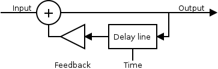
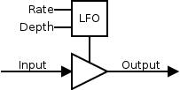
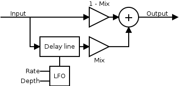
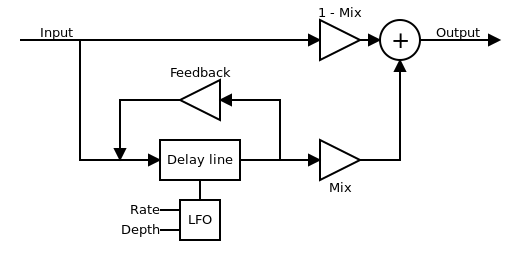

# yru-simple-LV2-C
Some simple LV2 plugin written in C. I used plugins examples from
http://lv2plug.in to have a template. These plugins are released under GPL V3
licence.

## Building plugins
At this time, there isn't global building. You need to go into each plugin
directory and do
```
./waf configure
./waf build
```
you can also install plugin, but i didn't tested this part
```
./waf install
```
## Plugins description

### simple-echo

It's just an echo effect with time and feedback parameter. Time controls delay
between repetition and feedback controls how repetitions decrease (higher
feedback mean lower decrease).

block diagram :



### simple-tremolo

It's a tremolo with a sinusoidal envelop. It have two parameter, rate and
depth.

block diagram :




### simple-chorus

A chorus effect with three parameters ; rate, depth and mix. A sinusoid is used
for the modulation.

block diagram :



### simple-flanger

A flanger effect with four parameters : rate, depth, feedback and mix. The LFO
generate a sinusoïd.

block diagram :


